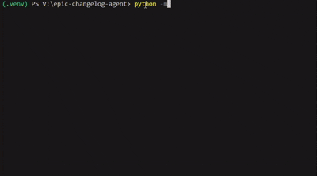

# Epic Logger Agent 🏰⚔️

An LLM-powered changelog writer that transforms mundane software updates into epic, theatrical narratives.

## Features

- 🎭 Transforms boring changelog entries into dramatic tales
- ⚡ Powered by Google Generative AI
- 🎨 Multiple theatrical styles and themes
- 📝 CLI interface for easy integration
- 🔧 Configurable drama levels
- 📦 Easy pip-style installation
- 🎨 Custom theme support with unlimited extensibility



## Installation

### Option 1: Install as Package (Recommended)
```bash
# Clone the repository
git clone <repository-url>
cd Epic-Logger-Agent

# Install the package
pip install -e .
```

### Option 2: Manual Installation
```bash
# Clone this repository
git clone <repository-url>
cd Epic-Logger-Agent

# Install dependencies
pip install -r requirements.txt
```

## Setup

Set up your Google API key:
```bash
# Create .env file with your API key
echo "GOOGLE_API_KEY=your_api_key_here" > .env
```

## Usage

### CLI Commands (After Package Installation)

The package provides three convenient commands:

```bash
# Primary command
epiclog "Fixed minor bug in login form"

# Alternative alias
changelog "Fixed minor bug in login form"
```

### Command Options

```bash
# Choose drama level (1-10)
epiclog "Added new feature" --drama-level 8

# Select theme
epiclog "Updated dependencies" --theme space

# Interactive mode
epiclog --interactive

# Process file with multiple entries
epiclog --file changelog_input.txt

# Save output to file
epiclog "Fixed bug" --output epic_changes.txt
```

### Theme Management Commands

```bash
# List all available themes (default and custom)
epiclog --list-themes

# Create a custom theme template
epiclog --create-theme horror

# Add a custom theme from JSON file
epiclog --add-theme /path/to/my_theme.json
```

### Example Output
- **Input:** "Fixed minor bug in login form"
- **Output:** "🗡️ Vanquished a lurking menace that had corrupted the sacred login flow, restoring peace to the realm of user authentication!"

### Manual Usage (Without Package Installation)
```bash
# With default drama level(7) and default theme(medieval)
python -m app.main "Fixed minor bug in login form"

# Choose drama level (1-10)
python -m app.main "Added new feature" --drama-level 8

# Select theme
python -m app.main "Updated dependencies" --theme space

# Interactive mode
python -m app.main --interactive

# Process file with multiple entries
python -m app.main --file changelog_input.txt

# Save output to file
python -m app.main --output epic_changes.txt
```


## Drama Levels
- **1-3**: Mildly dramatic
- **4-6**: Moderately epic
- **7-8**: Highly theatrical
- **9-10**: Maximum drama overload

## Themes

### Default Themes
- `medieval`: Knights, dragons, and quests ⚔️
- `space`: Cosmic battles and galactic adventures 🚀
- `superhero`: Powers, villains, and heroic deeds 💥
- `mythology`: Gods, legends, and ancient prophecies ⚡
- `cyberpunk`: Futuristic cyber adventures 🤖
- `pirate`: High-seas adventures 🏴‍☠️

### Custom Themes

Create unlimited custom themes! The Epic Logger Agent supports a powerful theme system:

#### Quick Start with Custom Themes
```bash
# See all available themes
epiclog --list-themes

# Create your own theme
epiclog --create-theme horror

# Use your custom theme
epiclog --theme horror "Fixed memory leak"
```

#### Creating Custom Themes
1. **Generate a template:**
   ```bash
   epiclog --create-theme western
   ```

2. **Edit the generated file** in `Themes/Custom_Themes/western_theme.json`:
   ```json
   {
       "name": "western",
       "display_name": "Wild West Adventure",
       "vocabulary": ["rustled", "gunned", "lassoed", "corralled"],
       "metaphors": ["sheriff", "outlaw", "saloon", "frontier"],
       "tone": "wild west frontier adventure",
       "emoji": "🤠",
       "description": "Transform code changes into frontier adventures"
   }
   ```

3. **Use immediately:**
   ```bash
   epiclog --theme western "Updated user authentication"
   ```

#### Theme Directory Structure
```
Themes/
├── Default_Themes/     # Built-in themes (6 themes)
│   ├── medieval_theme.json
│   ├── space_theme.json
│   └── ...
└── Custom_Themes/      # Your custom themes
    ├── horror_theme.json
    └── western_theme.json
```

## Configuration

Create a `.env` file with:
```
GOOGLE_API_KEY=your_google_api_key_here
DEFAULT_DRAMA_LEVEL=7
DEFAULT_THEME=medieval
DEFAULT_MODEL=gemini-2.5-flash
```

## Development

Run tests:
```bash
python -m pytest tests/
```